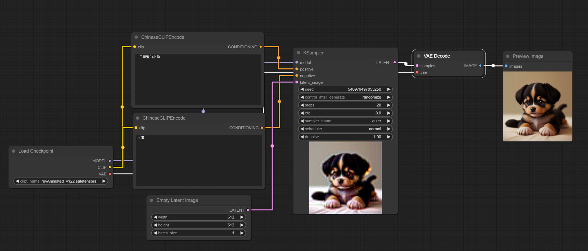

# Example
**Add Node / AI_Boy / ChineseCLIPEncode**

# Install
Clone this repository into the custom_nodes directory of ComfyUI, install the required dependency (`pip install translate`), and then restart ComfyUI.
